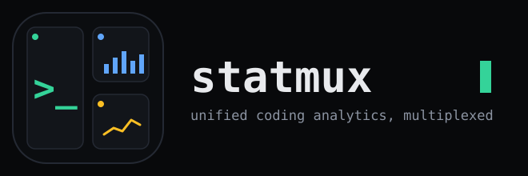

<p align="center">
  
</p>

<p align="center">
  <strong>Unified developer coding analytics, multiplexed across GitHub, Codeforces, and LeetCode.</strong>
</p>

<p align="center">
  <a href="https://statmux.sayan.cyou">Live App</a> &bull;
  <a href="#features">Features</a> &bull;
  <a href="#quick-start-local-development">Quick Start</a> &bull;
  <a href="#backend-api-specification">API Reference</a> &bull;
  <a href="./docs/SRS.md">System Architecture</a>
</p>

---

```
code-stack/
├── backend/            Express + Supabase API (runs on :3001)
├── frontend/           Next.js 16 + React 19 Dashboard (runs on :3000)
├── logo_and_animations/ Logos, badges, and SVG assets
└── docs/               System Requirements Specification, Architecture, and QA Test Cases
```

---

## Features

- **Dynamic Code Health Score**: Computes a holistic grade (A–D) and 0–100 score across 4 pillars: LeetCode difficulty, GitHub consistency, Repository quality, and Codeforces contest activity.
- **Activity Timeline**: Normalizes and streams commits, PRs, and accepted contest submissions into a unified reverse-chronological feed.
- **Profile Avatars**: Client-side HTML5 canvas image resizing ($500\times500$ px WebP) prior to uploading directly to Supabase Storage.
- **Public Shareable Profiles (`/u/[username]`)**: Unauthenticated developer cards showing handles, metrics, and Code Health badges.
- **Head-to-Head Developer Comparison (`/compare/[u1]/vs/[u2]`)**: Side-by-side benchmarking tool comparing overall scores, sub-pillar ratios, and platform winner badges.
- **Automated Weekly Email Digest**: Monday morning performance digests with week-over-week deltas sent via mxroute SMTP (`statmux@sayan.cyou`), featuring zero-spam delta detection and one-click cryptographic unsubscribe.
- **Automated Background Sync**: Scheduled daily stats refresh via GitHub Actions (`daily-refresh.yml`) hitting secret-protected internal endpoints.

---

## Quick Start (Local Development)

### 1. Configure the Backend

```bash
cd backend
npm install
# Copy and fill your environment variables:
cp .env.example .env
npm run dev
# → http://localhost:3001
```

### 2. Configure the Frontend

```bash
cd frontend
npm install
# Edit .env.local:
#   NEXT_PUBLIC_SUPABASE_URL=https://<YOUR-REF>.supabase.co
#   NEXT_PUBLIC_SUPABASE_ANON_KEY=<your anon key>
#   NEXT_PUBLIC_API_URL=http://localhost:3001
npm run dev
# → http://localhost:3000
```

### 3. Open the App

Visit **http://localhost:3000** $\rightarrow$ sign up (or sign in with GitHub) $\rightarrow$ go to **Profile** $\rightarrow$ add your platform handles $\rightarrow$ click **Refresh all**.

---

## Backend API Specification

| Method | Route | Auth | Description |
| :--- | :--- | :--- | :--- |
| `GET` | `/api/profile` | JWT Bearer | Get saved handles for authenticated user |
| `PUT` | `/api/profile` | JWT Bearer | Save or update platform handles |
| `GET` | `/api/profile/digest-subscription` | JWT Bearer | Get weekly email digest subscription status |
| `PUT` | `/api/profile/digest-subscription` | JWT Bearer | Update weekly email digest opt-in status |
| `POST` | `/api/profile/avatar` | JWT Bearer | Upload resized avatar to Supabase Storage |
| `GET` | `/api/stats` | JWT Bearer | Retrieve historical stat snapshots for authenticated user |
| `DELETE` | `/api/stats` | JWT Bearer | Delete all synced analytics data (Danger Zone) |
| `POST` | `/api/stats/refresh` | JWT Bearer | Fetch fresh stats from GitHub, Codeforces, and LeetCode |
| `GET` | `/api/public/:username` | Public | Lightweight shareable profile card (sanitized) |
| `GET` | `/api/public/compare/:u1/:u2` | Public | Head-to-head parallel developer comparison (sanitized) |
| `GET` | `/api/digest/unsubscribe` | Public (HMAC) | Cryptographically signed one-click unsubscribe endpoint |
| `POST` | `/api/internal/refresh-all` | `x-cron-secret` | Scheduled batch stats refresh across all user profiles |
| `POST` | `/api/internal/send-digests` | `x-cron-secret` | Scheduled batch weekly digest distribution |

---

## Environment Variables

### `backend/.env`
```env
SUPABASE_URL=https://<YOUR-REF>.supabase.co
SUPABASE_SERVICE_ROLE_KEY=your-service-role-key
CRON_SECRET=your-cron-secret
PORT=3001

# mxroute SMTP Credentials
SMTP_HOST=redbull.mxrouting.net
SMTP_PORT=465
SMTP_USER=statmux@sayan.cyou
SMTP_PASS=your-smtp-password
FRONTEND_URL=https://statmux.sayan.cyou
```

### `frontend/.env.local`
```env
NEXT_PUBLIC_SUPABASE_URL=https://<YOUR-REF>.supabase.co
NEXT_PUBLIC_SUPABASE_ANON_KEY=your-anon-public-key
NEXT_PUBLIC_API_URL=http://localhost:3001
```
