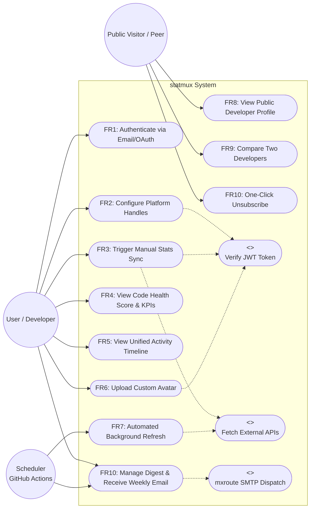
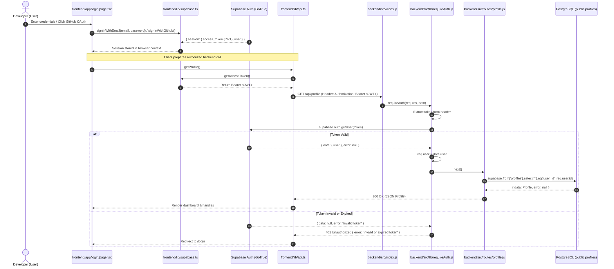
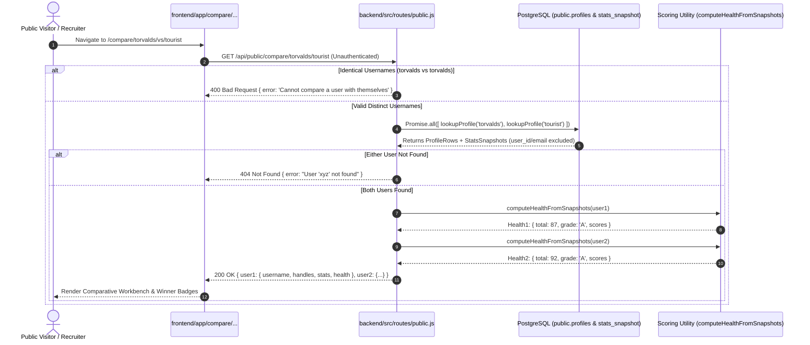
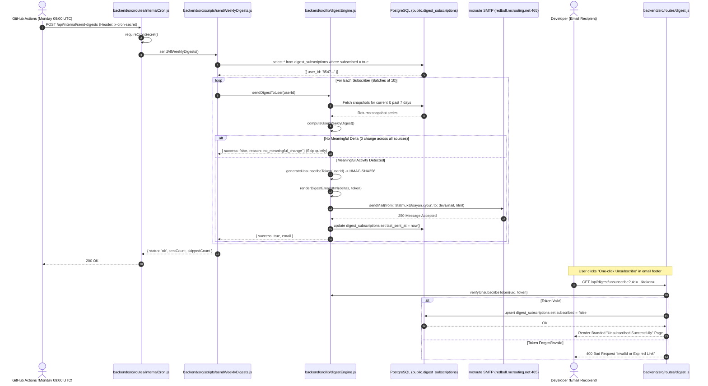
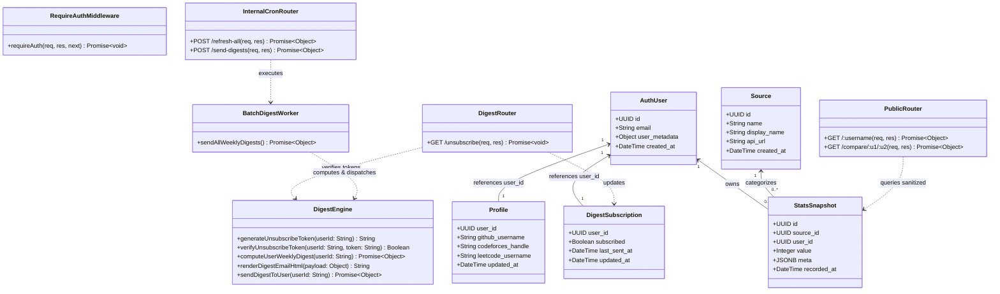
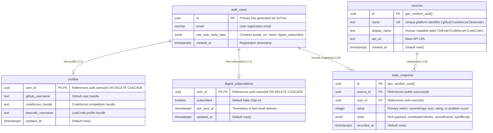

# Software Requirements Specification & System Design Document
## Project: statmux — Unified Coding Analytics Engine

---

## 1. System Overview & Requirements Specification

### 1.1 Functional Requirements (FR)

- **FR1 User Authentication**:
  - **Input**: User credentials (email/password) or GitHub OAuth authorization code.
  - **Processing**: Supabase GoTrue validates credentials and issues a cryptographically signed JWT; backend `requireAuth.js` middleware extracts and verifies the bearer token against Supabase Auth, attaching the verified user identity to `req.user`.
  - **Output**: Authenticated user session with JWT bearer token; redirection to protected dashboard routes (`/`, `/profile`, `/stats`, `/refresh`, `/settings`).

- **FR2 Platform Handle Configuration**:
  - **Input**: User profile input containing usernames/handles for external platforms (`github_username`, `codeforces_handle`, `leetcode_username`).
  - **Processing**: Backend validates authenticated session via `requireAuth.js` and executes an upsert query to `public.profiles` binding `user_id = req.user.id`.
  - **Output**: HTTP 200 response with updated `profiles` record; handle values populated across platform integration and profile views.

- **FR3 Multi-Platform Stats Synchronization**:
  - **Input**: On-demand sync request triggered by user (`POST /api/stats/refresh`) or handle lookup.
  - **Processing**: Backend resolves platform IDs from `public.sources`, concurrently invokes external platform fetchers (`fetchGithubStats`, `fetchCodeforcesRating`, `fetchLeetcodeSolved`), isolates failures via per-source `try/catch` blocks, and inserts resulting metrics and JSONB payloads into `public.stats_snapshot`.
  - **Output**: Array of refreshed platform snapshot results (`source`, `value`, `meta`, `ok`); updated time-series records in database.

- **FR4 Code Health Score Calculation**:
  - **Input**: Historical and latest snapshot metrics from `public.stats_snapshot` (GitHub active contribution weeks & repo count, Codeforces rating, LeetCode difficulty breakdown).
  - **Processing**: Pure scoring engine (`frontend/lib/scoring.ts` & `backend/src/lib/digestEngine.js`) calculates four normalized sub-scores ($0\text{--}100$ for consistency, problem difficulty, repository quality, and contest activity) and computes a composite arithmetic mean score and letter grade (A: $\ge80$, B: $\ge60$, C: $\ge40$, D: $<40$).
  - **Output**: Composite Code Health score ($0\text{--}100$), overall letter grade badge (A–D), and individual pillar progress bars rendered in `CodeHealthPanel`.

- **FR5 Unified Activity Timeline**:
  - **Input**: Nested JSONB `recentEvents` arrays extracted from latest GitHub (`PushEvent`, `PullRequestEvent`) and Codeforces (`accepted` submissions) snapshots.
  - **Processing**: Normalizes heterogeneous event schemas into uniform `ActivityEvent` structures, concatenates them into a single timeline stream, and sorts them in strict descending order by ISO timestamp.
  - **Output**: Rendered chronological activity feed with platform badges, event descriptions, repository/problem titles, and relative time labels.

- **FR6 Avatar Upload & Resizing**:
  - **Input**: Selected client-side image file (JPEG/PNG/WebP).
  - **Processing**: Renders image to an HTML5 `<canvas>` element resized to a maximum bounding box of $500\times500$ px, encodes to WebP base64, uploads binary buffer via backend to Supabase Storage `avatars` bucket, and updates user metadata `avatar_url`.
  - **Output**: Public CDN URL for stored avatar; immediate update to UI navigation header and profile picture.

- **FR7 Automated Background Refresh**:
  - **Input**: Scheduled HTTP POST trigger (`/api/internal/refresh-all`) from external cron runner (GitHub Actions / schedule) with secret token header `x-cron-secret`.
  - **Processing**: Backend validates `x-cron-secret` against environment variable `CRON_SECRET`, fetches all registered user profiles from `public.profiles`, sequentially syncs metrics for each platform with rate-limiting delay (`delay(1000)`), and inserts new snapshots without requiring active user sessions.
  - **Output**: HTTP 200 JSON status `{ status: 'ok', message: 'Refresh completed' }`; automated refresh logs recorded on backend.

- **FR8 Public Shareable Profiles**:
  - **Input**: Public profile route `/u/[username]` or `GET /api/public/:username`.
  - **Processing**: Backend executes case-insensitive lookup in `public.profiles` by `github_username`, fetches latest snapshot for each platform, calculates Code Health, and strips all private fields (`user_id`, `email`).
  - **Output**: Unauthenticated lightweight public card displaying Code Health pill, 3 platform counters, handles, and direct copy-to-clipboard action. Returns clean 404 if handle is not registered.

- **FR9 Head-to-Head Developer Comparison**:
  - **Input**: Comparison route `/compare/[user1]/vs/[user2]` or `GET /api/public/compare/:username1/:username2`.
  - **Processing**: Backend validates non-identical usernames (returns 400 if identical), concurrently executes parallel lookups (`Promise.all`) for both profiles, computes health and sub-pillar distributions, and computes metrics differentials.
  - **Output**: Unauthenticated side-by-side comparison view featuring overall score diff hero, dual-ratio sub-score bars, winner badges per platform, and responsive mobile stacking.

- **FR10 Automated Weekly Digest Email System**:
  - **Input**: Opt-in toggle on Settings/Profile page (`PUT /api/profile/digest-subscription`) or scheduled weekly cron trigger (`POST /api/internal/send-digests` with `x-cron-secret`).
  - **Processing**: Backend queries `public.digest_subscriptions` for opted-in users (`subscribed = true`), computes week-over-week deltas against snapshots from ~7 days prior, skips users with zero delta (`no_meaningful_change`), renders responsive dark-themed HTML email with signed HMAC-SHA256 unsubscribe token, and dispatches via mxroute SMTP in throttled batches of 10.
  - **Output**: Delivered weekly digest email from `statmux@sayan.cyou`; one-click cryptographic unsubscribe endpoint `GET /api/digest/unsubscribe?uid=...&token=...` that flips subscription without requiring login.

### 1.2 Non-Functional Requirements (NFR)
- **NFR1 Reliability & Fault Isolation**: Platform API failures (e.g. rate limits, network timeouts, invalid handles) must be isolated with try-catch boundaries so that one failing platform does not abort remaining platforms or halt batch cron distribution.
- **NFR2 Security & Access Control**: Express endpoints must enforce token verification using `requireAuth.js` middleware; public routes (`/api/public/*`, `/api/digest/unsubscribe`) must omit internal IDs/emails and verify cryptographic signatures; cron endpoints must enforce `x-cron-secret`.

---

## 2. Use Case Diagram

---

## 3. Sequence Diagram: FR1 (User Authentication & Session Verification)

Traced to: [`frontend/app/login/page.tsx`](file:///home/chai/dox/actual%20learning/code-stack/frontend/app/login/page.tsx), [`frontend/lib/supabase.ts`](file:///home/chai/dox/actual%20learning/code-stack/frontend/lib/supabase.ts), [`frontend/lib/api.ts`](file:///home/chai/dox/actual%20learning/code-stack/frontend/lib/api.ts), [`backend/src/lib/requireAuth.js`](file:///home/chai/dox/actual%20learning/code-stack/backend/src/lib/requireAuth.js), and [`backend/src/routes/profile.js`](file:///home/chai/dox/actual%20learning/code-stack/backend/src/routes/profile.js).

---

## 4. Sequence Diagram: FR8 & FR9 (Public Profile & Head-to-Head Comparison)

Traced to: [`backend/src/routes/public.js`](file:///home/chai/dox/actual%20learning/code-stack/backend/src/routes/public.js), [`frontend/app/u/[username]/page.tsx`](file:///home/chai/dox/actual%20learning/code-stack/frontend/app/u/%5Busername%5D/page.tsx), and [`frontend/app/compare/[user1]/vs/[user2]/page.tsx`](file:///home/chai/dox/actual%20learning/code-stack/frontend/app/compare/%5Buser1%5D/vs/%5Buser2%5D/page.tsx).

---

## 5. Sequence Diagram: FR10 (Weekly Digest & One-Click Cryptographic Unsubscribe)

Traced to: [`backend/src/routes/internalCron.js`](file:///home/chai/dox/actual%20learning/code-stack/backend/src/routes/internalCron.js), [`backend/src/lib/digestEngine.js`](file:///home/chai/dox/actual%20learning/code-stack/backend/src/lib/digestEngine.js), [`backend/src/routes/digest.js`](file:///home/chai/dox/actual%20learning/code-stack/backend/src/routes/digest.js), and mxroute SMTP.

---

## 6. Class Diagram (Backend Architecture & Data Models)

Traced to: [`backend/src/lib/`](file:///home/chai/dox/actual%20learning/code-stack/backend/src/lib/), [`backend/src/routes/`](file:///home/chai/dox/actual%20learning/code-stack/backend/src/routes/), [`backend/src/scripts/`](file:///home/chai/dox/actual%20learning/code-stack/backend/src/scripts/), and Supabase schema.

---

## 7. Entity Relationship (ER) Diagram

---

## 8. Requirement Traceability Matrix (RTM)

| Req ID | Requirement Description | Design Artifact | Implementation (File Path & Symbol) | Test Case ID |
| :--- | :--- | :--- | :--- | :--- |
| **FR1** | User Authentication & JWT Issuance | Use Case, Sequence Diagram (FR1) | [`frontend/app/login/page.tsx`](file:///home/chai/dox/actual%20learning/code-stack/frontend/app/login/page.tsx), [`frontend/lib/supabase.ts`](file:///home/chai/dox/actual%20learning/code-stack/frontend/lib/supabase.ts), [`backend/src/lib/requireAuth.js`](file:///home/chai/dox/actual%20learning/code-stack/backend/src/lib/requireAuth.js) | TC01, TC02, TC03 |
| **FR2** | Platform Handle Configuration | Use Case, Class Diagram | [`frontend/app/profile/page.tsx`](file:///home/chai/dox/actual%20learning/code-stack/frontend/app/profile/page.tsx), [`backend/src/routes/profile.js`](file:///home/chai/dox/actual%20learning/code-stack/backend/src/routes/profile.js) (`PUT /`) | TC04, TC05 |
| **FR3** | Multi-Platform Stats Synchronization | Use Case, Sequence Diagram | [`frontend/app/refresh/page.tsx`](file:///home/chai/dox/actual%20learning/code-stack/frontend/app/refresh/page.tsx), [`backend/src/routes/refresh.js`](file:///home/chai/dox/actual%20learning/code-stack/backend/src/routes/refresh.js) | TC06, TC07 |
| **FR4** | Code Health Score Calculation | Use Case, Class Diagram | [`frontend/lib/scoring.ts`](file:///home/chai/dox/actual%20learning/code-stack/frontend/lib/scoring.ts) (`calculateCodeHealth`), [`backend/src/lib/digestEngine.js`](file:///home/chai/dox/actual%20learning/code-stack/backend/src/lib/digestEngine.js) (`computeHealth`) | TC08 |
| **FR5** | Unified Activity Timeline | Use Case, Class Diagram | [`frontend/app/page.tsx`](file:///home/chai/dox/actual%20learning/code-stack/frontend/app/page.tsx), [`frontend/components/activity-timeline.tsx`](file:///home/chai/dox/actual%20learning/code-stack/frontend/components/activity-timeline.tsx) | TC09 |
| **FR6** | Avatar Upload & Resizing | Use Case, Class Diagram | [`frontend/app/profile/page.tsx`](file:///home/chai/dox/actual%20learning/code-stack/frontend/app/profile/page.tsx), [`backend/src/routes/profile.js`](file:///home/chai/dox/actual%20learning/code-stack/backend/src/routes/profile.js) (`POST /avatar`) | TC10 |
| **FR7** | Automated Background Refresh | Use Case, Activity Diagram | [`backend/.github/workflows/daily-refresh.yml`](file:///home/chai/dox/actual%20learning/code-stack/backend/.github/workflows/daily-refresh.yml), [`backend/src/routes/internalCron.js`](file:///home/chai/dox/actual%20learning/code-stack/backend/src/routes/internalCron.js) (`POST /refresh-all`) | TC11, TC12, TC13 |
| **FR8** | Public Shareable Profiles | Use Case, Sequence Diagram (FR8/9) | [`frontend/app/u/[username]/page.tsx`](file:///home/chai/dox/actual%20learning/code-stack/frontend/app/u/%5Busername%5D/page.tsx), [`backend/src/routes/public.js`](file:///home/chai/dox/actual%20learning/code-stack/backend/src/routes/public.js) (`GET /:username`) | TC18 |
| **FR9** | Head-to-Head Developer Comparison | Use Case, Sequence Diagram (FR8/9) | [`frontend/app/compare/[user1]/vs/[user2]/page.tsx`](file:///home/chai/dox/actual%20learning/code-stack/frontend/app/compare/%5Buser1%5D/vs/%5Buser2%5D/page.tsx), [`backend/src/routes/public.js`](file:///home/chai/dox/actual%20learning/code-stack/backend/src/routes/public.js) (`GET /compare/:u1/:u2`) | TC19 |
| **FR10** | Weekly Digest & Cryptographic Unsubscribe | Use Case, Sequence Diagram (FR10) | [`backend/src/lib/digestEngine.js`](file:///home/chai/dox/actual%20learning/code-stack/backend/src/lib/digestEngine.js), [`backend/src/routes/digest.js`](file:///home/chai/dox/actual%20learning/code-stack/backend/src/routes/digest.js), [`backend/src/routes/internalCron.js`](file:///home/chai/dox/actual%20learning/code-stack/backend/src/routes/internalCron.js) (`POST /send-digests`), [`backend/.github/workflows/weekly-digest.yml`](file:///home/chai/dox/actual%20learning/code-stack/backend/.github/workflows/weekly-digest.yml) | TC20, TC21 |
| **NFR1** | Reliability & Fault Isolation | Sequence Diagram, Activity Diagram | [`backend/src/routes/refresh.js`](file:///home/chai/dox/actual%20learning/code-stack/backend/src/routes/refresh.js), [`backend/src/scripts/refreshAllUsers.js`](file:///home/chai/dox/actual%20learning/code-stack/backend/src/scripts/refreshAllUsers.js), [`backend/src/scripts/sendWeeklyDigests.js`](file:///home/chai/dox/actual%20learning/code-stack/backend/src/scripts/sendWeeklyDigests.js) | TC07, TC13, TC20 |
| **NFR2** | Security & Access Control | Sequence Diagram, Class Diagram | [`backend/src/lib/requireAuth.js`](file:///home/chai/dox/actual%20learning/code-stack/backend/src/lib/requireAuth.js), [`backend/src/routes/public.js`](file:///home/chai/dox/actual%20learning/code-stack/backend/src/routes/public.js) (sanitization), [`backend/src/routes/digest.js`](file:///home/chai/dox/actual%20learning/code-stack/backend/src/routes/digest.js) (HMAC verification) | TC03, TC12, TC14, TC18, TC19, TC21 |
